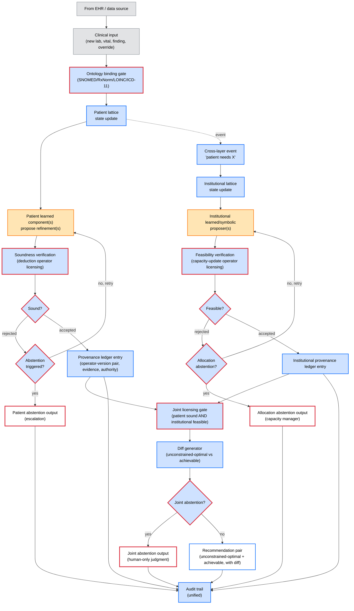
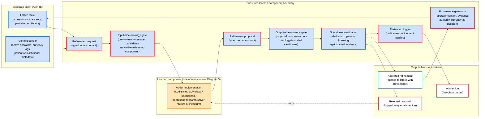
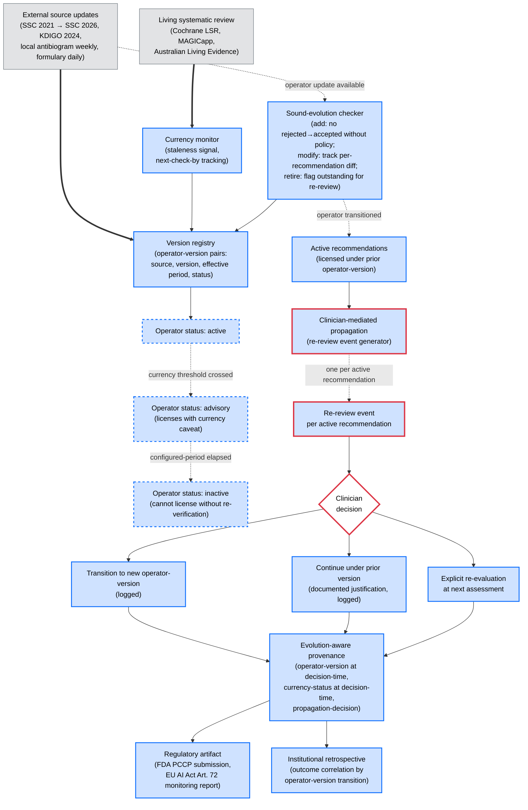

# Substrate-First Clinical AI: Architecture Diagrams

**Version:** v0.1.0-draft
**Date:** 2026-05-24
**Status:** Working draft for scrutiny. Companion to substrate-first-clinical-ai-v0.10.1-draft.md.
**License (proposed, open decision):** CC BY 4.0

---

## Purpose

These diagrams visualize the architecture specified in the position note (v0.10.1). They are not a replacement for the prose; they are an aid to comprehension. The position note is the source of truth; where a diagram and the note disagree, the note wins and the diagram is wrong.

Five diagrams, each addressing a primary view the others cannot show:

1. **Component decomposition** — what's in the system, organized by the four architectural axes (4A, 4B, 4C, 4D).
2. **Data and event flow** — how a clinical input traverses the system and produces an output.
3. **Substrate-learned-component boundary** — the interface contract that makes learned components safe by construction.
4. **Temporal-evolution lifecycle** — how substrate components evolve over deployment time (months to years).
5. **Learned-component composition (expansion of 3)** — the enumerated set of task-specific learned and symbolic-proposer components that plug into the substrate's interfaces.

---

## Visual conventions (apply across all five diagrams)

| Visual element | Architectural meaning |
| --- | --- |
| Rectangle | Component (substrate element, learned component, infrastructure) |
| Rounded rectangle | External system (EHR, clinical ontology, guideline source, regulatory infrastructure) |
| Diamond | Decision point where abstention can fire |
| Solid arrow | Synchronous call or required relationship |
| Dashed arrow | Event or asynchronous notification |
| Bold border | Component that enforces an architectural safety property (substrate-as-safety-boundary) |
| Dashed border | Research-question component, not yet ready to build |
| Color: blue | Substrate (symbolic infrastructure) |
| Color: orange | Learned components (probabilistic, ML/AI models) |
| Color: green | Symbolic proposers (operations-research solvers, deterministic algorithms — propose moves like learned components but are not learned) |
| Color: gray | External systems and infrastructure |
| Color: red (border) | Abstention output or safety-critical gate |
| Label on arrow | What flows along that relationship (data type, event type, return type) |

Mermaid's class/style support is used to encode color. Bold and dashed borders are encoded via stroke-width and stroke-dasharray respectively.

---

## Diagram 1: Component decomposition

The architectural skeleton, organized by the four axes from position note Section 4 plus cross-cutting concerns. Top-level only — sub-components within the "Learned components zone" are expanded in Diagram 5.

```mermaid
graph TB
    subgraph EXT["External systems"]
        EHR["EHR / clinical data sources"]
        ONT["Clinical ontologies<br/>SNOMED CT, RxNorm, LOINC, ICD-11"]
        GUIDE["Guideline sources<br/>SSC, KDIGO, IDSA/ATS, CHEST"]
        STD["Standards infrastructure<br/>HL7 FHIR CR, CQL, MAGICapp"]
        REG["Regulatory infrastructure<br/>FDA PCCP, EU AI Act Art. 72"]
    end

    subgraph A4["4A — Patient-state substrate"]
        PL["Patient lattice<br/>(candidate sets, partial order)"]
        PDO["Patient deduction operators<br/>(SOFA, Wells, KDIGO, CURB-65, ...)"]
        PSB["Search & backtrack procedure"]
        PAB["Patient abstention semantics"]
        PPR["Patient provenance ledger"]
        PLC_ZONE["Patient learned components zone<br/>(see Diagram 5 for enumeration)"]
    end

    subgraph B4["4B — Institutional-state substrate"]
        IL["Institutional lattice<br/>(resource state, feasibility partial order)"]
        IDO["Capacity-update operators<br/>(admit, discharge, dispense, deliver, ...)"]
        IAP["Allocation policy layer<br/>(priority, equity, scarcity ethics)"]
        IAB["Allocation abstention semantics"]
        IPR["Institutional provenance ledger"]
        ILC_ZONE["Institutional learned + symbolic-proposer zone<br/>(see Diagram 5 for enumeration)"]
    end

    subgraph C4["4C — Interaction semantics"]
        JL["Joint licensing gate"]
        XE["Cross-layer event bus<br/>(typed, provenanced, bidirectional)"]
        JAB["Joint abstention output"]
    end

    subgraph D4["4D — Temporal evolution"]
        VR["Version registry<br/>(operator-version pairs, effective period, status)"]
        CC["Currency monitor<br/>(staleness signal, advisory/inactive downgrades)"]
        SE["Sound-evolution checker<br/>(add/modify/retire semantics)"]
        CMP["Clinician-mediated propagation<br/>(re-review event generator)"]
        EAP["Evolution-aware provenance"]
    end

    subgraph CC_CONCERNS["Cross-cutting concerns"]
        AUD["Audit infrastructure<br/>(unified across 4A, 4B, 4D)"]
        OB["Ontology binding<br/>(used across 4A, 4B, 4D)"]
        CI["Clinician interface<br/>(both layers, diff display, override capture)"]
        CMI["Capacity-management interface<br/>(administrator-facing)"]
        EH["Evaluation harness<br/>(patient + institutional + joint metrics)"]
        RA["Regulatory artifact production<br/>(PCCP submissions, Art. 72 reports)"]
    end

    EHR ==> PL
    ONT ==> OB
    OB ==> PL
    OB ==> IL
    GUIDE ==> VR
    STD ==> VR
    REG ==> RA

    PL <==> PDO
    PDO <==> PSB
    PSB --> PAB
    PL --> PPR
    PLC_ZONE -.proposes refinement.-> PL

    IL <==> IDO
    IDO <==> IAP
    IAP --> IAB
    IL --> IPR
    ILC_ZONE -.proposes refinement.-> IL

    PL <-.cross-layer events.-> XE
    IL <-.cross-layer events.-> XE
    XE --> JL
    JL --> JAB

    VR --> PDO
    VR --> IDO
    CC --> VR
    SE --> VR
    CMP -.re-review events.-> CI
    EAP --> PPR
    EAP --> IPR

    PPR --> AUD
    IPR --> AUD
    JL --> CI
    JAB --> CI
    IAB --> CMI
    AUD --> RA

    classDef substrate fill:#cfe2ff,stroke:#0d6efd,stroke-width:2px,color:#000
    classDef learnedZone fill:#ffe5b4,stroke:#fd7e14,stroke-width:2px,stroke-dasharray:5 5,color:#000
    classDef external fill:#e2e3e5,stroke:#6c757d,stroke-width:1px,color:#000
    classDef safetyGate fill:#cfe2ff,stroke:#dc3545,stroke-width:3px,color:#000
    classDef crossCutting fill:#d1e7dd,stroke:#198754,stroke-width:1px,color:#000

    class PL,PDO,PSB,PPR,IL,IDO,IAP,IPR,XE,VR,CC,SE,EAP substrate
    class PAB,IAB,JL,JAB,CMP safetyGate
    class PLC_ZONE,ILC_ZONE learnedZone
    class EHR,ONT,GUIDE,STD,REG external
    class AUD,OB,CI,CMI,EH,RA crossCutting
```

**Reading this diagram.** Five zones, four architectural axes plus cross-cutting concerns. The patient-state substrate (4A, blue) and institutional-state substrate (4B, also blue) are the two coupled lattices the position note's Section 5 names. The interaction semantics (4C, red borders) sit between them, carrying joint licensing, cross-layer events, and joint abstention. Temporal evolution (4D, blue, with red borders on the propagation event generator) sits to the side and feeds versioning information into both substrates' deduction operators. External systems (gray, rounded) flow into the architecture from the top. Cross-cutting concerns (green) span all four axes and produce outputs to clinicians, administrators, evaluators, and regulators.

Learned components are deliberately shown as opaque "zones" at this level (orange, dashed-border-for-research-question). The expansion is in Diagram 5. The position note (4A.5, 4B.5) supports this multi-component reading; Diagram 5 enumerates the specific learned components and symbolic proposers that plug into each substrate's interface.

---

## Diagram 2: Data and event flow

How a clinical input traverses the system and produces an output. Dynamic view, single-encounter timescale (minutes to hours). The substrate-learned-component boundary is visible but not zoomed; Diagram 3 zooms in on it.

**Reading this diagram.** A clinical input enters from the EHR, passes through the ontology-binding gate (rejected if outside SNOMED/RxNorm/LOINC/ICD-11), updates the patient lattice state, and triggers learned-component proposal of a refinement. The refinement is verified against deduction operators (with currency tag from 4D's version registry); unsound proposals trigger retry or abstention. Sound proposals are logged to provenance with operator-version pair and evidence. A cross-layer event fires to the institutional lattice, which runs an analogous flow on the institutional side: capacity-update operator licensing, allocation abstention if infeasible, provenance with attribution. Both provenance entries reach the joint-licensing gate; the diff generator produces the unconstrained-optimal-versus-achievable pair if both substrates license, or joint abstention fires if neither does. All outputs feed the unified audit trail. Three abstention types (patient, allocation, joint) are first-class outputs with distinct escalation semantics per Section 4A.3, 4B.3, 4C.

The diagram does not show the temporal-evolution lifecycle (Diagram 4 covers that, on a different timescale) nor the internal structure of the learned-component zones (Diagram 5 covers that). The learned components appear here as single boxes; the boundary contract they satisfy is what Diagram 3 zooms in on.

---

## Diagram 3: Substrate-learned-component boundary

The interface contract that makes the substrate-first commitment work. This is the diagram that most directly captures the architecture's central claim: the substrate's safety properties do not depend on which specific model sits at the interface, as long as the interface contract is satisfied.

Shown here for one substrate-side interface; the same contract shape applies to every substrate-learned-component boundary in the system.

**Reading this diagram.** The substrate sends the learned component a typed request containing the current lattice state and context (active operators, currency tags, patient or institutional metadata). The request passes through an input-side ontology gate: the learned component only sees candidates that are within the substrate's ontology (SNOMED CT, RxNorm, LOINC, ICD-11). The model — which can be LDT-style, LLM-class, specialized for a specific task, or even an operations-research solver on the institutional side — produces a typed proposal. The proposal passes through the output-side ontology gate (proposal must name only ontology-bounded candidates) and then through soundness verification (does any deduction operator with cited evidence license this proposal?). Three outcomes: accepted (refinement applied to lattice with provenance), rejected (logged, may trigger retry or abstention), or abstention (first-class output emitted).

**Why this is the load-bearing diagram.** The substrate's safety properties are encoded in the gates and the verification, not in the model. Swap the model — LDT-style today, LLM-class tomorrow, future architecture in five years — and the safety properties hold as long as the interface contract is satisfied. The architecture's central claim, in visual form: *the substrate constrains the learned component, not the other way around, and this is what allows the learned component to be wrong without the system being unsafe* (position note 4A.5, 4B.5).

The same boundary shape applies to every learned-component slot in the system. Diagram 5 enumerates the slots; this diagram defines what each slot's contract looks like.

---

## Diagram 4: Temporal-evolution lifecycle

How substrate components evolve over deployment time. Different timescale from Diagrams 2 and 3 — months and years rather than minutes and hours. The 7E.6 worked example in the position note instantiates this lifecycle for the SSC 2021 → SSC 2026 transition; this diagram is the general shape that instantiation follows.

**Reading this diagram.** External sources update at their own cadences (SSC every 4-5 years per 4D.2, KDIGO decadal with focused updates, antibiogram weekly, formulary daily). Living systematic review infrastructure (Cochrane LSR, MAGICapp, Australian Living Evidence Collaboration) feeds currency signals to the substrate's currency monitor. The version registry tracks every operator-version pair with effective period and status. Operators progress through three states: active (default), advisory (currency threshold crossed, licenses with explicit caveat), inactive (configured-period elapsed past threshold, cannot license without re-verification).

When an operator update is available, the sound-evolution checker enforces the semantics of position note 4D.3: adding a new operator must not silently license previously-rejected recommendations; modifying tracks per-recommendation licensing differences; retiring flags outstanding recommendations for re-review.

For active recommendations licensed under a prior operator-version, the clinician-mediated propagation generator (4D.4 — the load-bearing safety claim of Section 4D) emits one re-review event per active recommendation. The clinician decides: transition to the new operator-version, continue under the prior version with documented justification, or hold for explicit re-evaluation at next assessment. All three decisions are logged in evolution-aware provenance.

Evolution-aware provenance (4D.5) supports two downstream uses: regulatory artifact production (FDA PCCP submissions for change-control records, EU AI Act Article 72 post-market monitoring reports) and institutional retrospective analysis (outcome correlation by operator-version transition — did patients transitioned at point X have different outcomes than those continuing on the prior operator?).

The 7E.6 worked example in the position note traces this lifecycle for the SSC 2021 → SSC 2026 transition concretely. The general shape this diagram shows is what 7E.6 instantiates.

---

## Diagram 5: Learned-component composition (expansion of Diagram 3)

The enumerated set of task-specific learned components and symbolic proposers that plug into the substrate's interfaces, drawn from position note Sections 4A.5 and 4B.5. Side-by-side columns separate patient-substrate components from institutional-substrate components, since the substrate distinction is architecturally significant (different lattice structures, different deduction-operator libraries, different abstention semantics).

Each component is shown at its interface position with: (a) the task it performs, (b) the architectural-options labels for the model that implements it (the architecture is agnostic about which option is chosen as long as the interface contract from Diagram 3 is satisfied), and (c) a maturity tag indicating whether the component slot is "plug in a known model" or "still requires architecture research."

```mermaid
flowchart TB
    subgraph SUB_P["Patient-substrate side"]
        PL_IF["Patient lattice<br/>interface contract<br/>(see Diagram 3)"]
    end

    subgraph SUB_I["Institutional-substrate side"]
        IL_IF["Institutional lattice<br/>interface contract<br/>(see Diagram 3)"]
    end

    subgraph PLC["Patient learned components (note §4A.5)"]
        RP["Refinement proposer<br/>(lattice-search component)<br/>Options: LDT-style / LLM-class /<br/>HRM-class / new architecture<br/>Maturity: research question"]
        IMG["Imaging recognizer(s)<br/>(radiology, pathology, dermatology)<br/>Options: vision transformer / specialized CNN<br/>Maturity: production-ready in literature"]
        PATH["Pathology morphology recognizer<br/>Options: specialized vision model<br/>Maturity: production-ready in literature"]
        ICU["ICU trajectory forecaster<br/>Options: state-space model /<br/>Temporal Fusion Transformer / RNN<br/>Maturity: production-ready in literature"]
        RPC["Rare phenotype clustering<br/>Options: contrastive embedding /<br/>specialized clustering<br/>Maturity: active research area"]
        MMI["Multimodal signal integrator<br/>(structured EHR + notes + imaging + time-series)<br/>Options: multimodal transformer / fusion model<br/>Maturity: active research area"]
        AR["Ambiguity ranker<br/>(prioritize candidate for next-test selection)<br/>Options: learned ranker / Bayesian<br/>Maturity: well-established"]
        DE["Differential expander<br/>(suggest candidates substrate has not considered)<br/>Options: LLM-class / specialized retrieval<br/>Maturity: active research area"]
        NS["Note synthesizer<br/>(narrative output from substrate state)<br/>Options: LLM-class under substrate constraints<br/>Maturity: active research area"]
        PSC["Prognostic scorer(s)<br/>(mortality, readmission, deterioration)<br/>Options: gradient boosting / specialized DL<br/>Maturity: well-established per outcome"]
    end

    subgraph ILC_LEARNED["Institutional learned components (note §4B.5)"]
        DF["Demand forecaster<br/>(anticipated admissions 6/24/72h)<br/>Options: state-space / Temporal Fusion Transformer /<br/>specialized time-series<br/>Maturity: well-established"]
        QDP["Queue dynamics predictor<br/>(expected wait times)<br/>Options: queueing-theory + ML / specialized<br/>Maturity: well-established"]
        LOS["Length-of-stay estimator<br/>Options: survival analysis / gradient boosting / DL<br/>Maturity: well-established"]
        SDP["Supply depletion projector<br/>(drug, blood product, consumable inventory)<br/>Options: time-series forecasting / ARIMA / DL<br/>Maturity: well-established"]
    end

    subgraph ILC_SYMBOLIC["Institutional symbolic proposers (note §5)"]
        ORS["Operations-research solver(s)<br/>(scheduling, assignment, routing)<br/>Options: MILP / constraint programming / heuristic<br/>Maturity: well-established"]
        APL["Allocation policy logic<br/>(priority, equity, scarcity ethics)<br/>Options: hand-specified rules<br/>Maturity: production by design"]
    end

    PL_IF --- RP
    PL_IF --- IMG
    PL_IF --- PATH
    PL_IF --- ICU
    PL_IF --- RPC
    PL_IF --- MMI
    PL_IF --- AR
    PL_IF --- DE
    PL_IF --- NS
    PL_IF --- PSC

    IL_IF --- DF
    IL_IF --- QDP
    IL_IF --- LOS
    IL_IF --- SDP
    IL_IF --- ORS
    IL_IF --- APL

    classDef substrate fill:#cfe2ff,stroke:#0d6efd,stroke-width:2px,color:#000
    classDef learnedWellEst fill:#ffe5b4,stroke:#fd7e14,stroke-width:2px,color:#000
    classDef learnedActiveResearch fill:#ffe5b4,stroke:#fd7e14,stroke-width:2px,stroke-dasharray:3 3,color:#000
    classDef learnedResearchQ fill:#ffe5b4,stroke:#fd7e14,stroke-width:2px,stroke-dasharray:8 4,color:#000
    classDef symbolic fill:#d1e7dd,stroke:#198754,stroke-width:2px,color:#000

    class PL_IF,IL_IF substrate
    class IMG,PATH,ICU,AR,PSC,DF,QDP,LOS,SDP learnedWellEst
    class RPC,MMI,DE,NS learnedActiveResearch
    class RP learnedResearchQ
    class ORS,APL symbolic
```

**Reading this diagram.** Two columns separate patient-substrate learned components from institutional-substrate learned and symbolic-proposer components.

**Patient-substrate side (orange, learned components).** Ten task-specific components, every one named in position note Section 4A.5 ("imaging pattern recognition, pathology morphology, ICU trajectory forecasting, rare phenotype clustering, multimodal signal integration, ambiguity ranking, differential expansion, note synthesis") plus the refinement proposer that does lattice-search and operator selection (4A.5's "the transformer (or whatever the learned component is)") plus prognostic scorers that the note's 7E.1 sepsis example explicitly invokes. Each component lists its architectural options without committing to any single choice: the refinement proposer slot can be filled by LDT-style, LLM-class, HRM-class, or a future architecture entirely. The substrate doesn't care which, as long as the Diagram 3 interface contract is satisfied.

**Institutional-substrate side, learned components (orange).** Four task-specific components, every one named in 4B.5 ("demand forecasting models, queue dynamics predictors, supply availability estimators, length-of-stay predictors"). Each with its architectural-options labels.

**Institutional-substrate side, symbolic proposers (green).** The note's Section 5 explicitly names operations-research solvers as a component class on the institutional side: "the institutional lattice typically a mix of forecasting models, queue dynamics estimators, and operations-research solvers." These propose moves to the institutional substrate just like learned components do — the substrate licenses or rejects them through the same interface — but they are not learned. They are deterministic algorithms (MILP, constraint programming, hand-specified allocation policies). The visual distinction (green vs. orange) reflects this architectural significance: same interface position, different epistemic basis.

**Maturity asymmetry is shown by border style.** Solid borders are well-established components where the architecture decision is "plug in a known model" — vision transformers for imaging, gradient boosting for prognostic scoring, time-series models for demand forecasting. Short-dashed borders are active research areas where multiple plausible architectures exist and the right choice is empirically open — multimodal integration, rare phenotype clustering, differential expansion, note synthesis under substrate constraints. Long-dashed borders are research questions where the architecture itself is the open problem — the refinement proposer is the headline example. The position note's Section 7 timeline predictions (2-4 years for narrow applications, 5-8 years for broader diagnostic reasoning, 8-12 years for novelty-handling) reflect this asymmetry directly.

**What the diagram is not committing to.** Specific model architectures at each slot. The substrate-first architecture's claim is that the safety property holds across model choices at each interface position. The labels list options; they do not pick.

**The refinement proposer slot is highlighted as the headline research question.** The position note's Section 5 line 155 names it as the "transformer-branching" point: "The most plausible learned component, given current technical maturity, is a recurrent transformer of the LDT type" *[inferred]*. Most plausible per current maturity is not a commitment; it's a working assumption. If a different architecture turns out to be better suited to the refinement-proposing task under clinical lattice constraints, the substrate's safety properties hold under the swap.

---

## Cross-diagram traceability to position note sections

| Diagram | Maps to position note section(s) |
| --- | --- |
| 1: Component decomposition | Section 4 (4A, 4B, 4C, 4D), Section 5 (system identity), Section 7A/B/C (build description) |
| 2: Data and event flow | Section 4A.1-4A.4, 4B.1-4B.4, 4C, plus 7E.1 (sepsis worked example for concrete instantiation) |
| 3: Substrate-learned-component boundary | Section 4A.5, 4B.5, 4C, plus Section 5 (regulatory positioning under UNDCS taxonomy) |
| 4: Temporal-evolution lifecycle | Section 4D (all five principles), Section 6 temporal-evolution prior art subsection, Section 7E.6 worked example |
| 5: Learned-component composition (expansion of 3) | Section 4A.5 (enumerated patient learned components), Section 4B.5 (enumerated institutional learned components), Section 5 (operations-research solvers, transformer-branching) |

If a future revision of the position note adds, removes, or substantively modifies any principle in Section 4, the relevant diagram(s) above need updating to match. The diagrams version independently of the note; this v0.1.0 reflects note v0.10.1.

---

## Open decisions

1. **Whether to add a 6th diagram for cross-cutting concerns specifically.** Currently audit infrastructure, ontology binding, clinician interface, capacity-management interface, evaluation harness, and regulatory artifact production are visible in Diagram 1 but not zoomed. A 6th diagram showing how each cross-cutting concern threads through the four axes would add legibility at the cost of one more diagram to maintain. Deferred to v0.2.0 of the diagrams pending feedback on whether the current set is sufficient.

2. **Whether Diagram 5 should be split further by maturity.** Currently maturity is encoded in border style, which is subtle. An alternative would be three sub-diagrams in Diagram 5: well-established components, active-research components, research-question components. Subtle border encoding is more compact; explicit sub-diagrams are more legible. Lean toward keeping it as one diagram for v0.1.0; revisit if border styles prove too subtle in actual reading.

3. **Whether the visual conventions should be moved into a shared style file.** Mermaid supports `init` blocks for shared themes. A shared theme would keep colors and stroke widths consistent across diagrams without repetition in each diagram's classDef. Deferred to v0.2.0; v0.1.0 uses inline classDef for clarity.

4. **Whether to produce an executive-summary single-diagram view** for audiences who will only look at one picture. Single-diagram views encode trade-offs explicitly (some detail must be hidden), so the question is what gets hidden. Deferred pending feedback on whether the audience for an executive-summary view exists.

---

## Changelog

- **v0.1.0-draft (2026-05-24):** Initial draft. Five Mermaid diagrams covering component decomposition (1), data and event flow (2), substrate-learned-component boundary (3), temporal-evolution lifecycle (4), and learned-component composition as expansion of 3 (5). Visual conventions stated once at the top and applied across all five. Cross-diagram traceability table mapping each diagram to position note sections. Maturity asymmetry encoded via border style (solid / short-dashed / long-dashed) in Diagram 5. Side-by-side columns separate patient-substrate components from institutional-substrate components in Diagram 5. Symbolic proposers (operations-research solvers, hand-specified allocation policies) shown with green coloring to distinguish from learned components (orange) while preserving the architectural truth that they sit at the same interface position. Refinement proposer slot in Diagram 5 highlighted as the headline research question per Section 5 line 155's *[inferred]* "transformer-branching" claim, with architectural options listed (LDT-style / LLM-class / HRM-class / new architecture entirely) and no commitment to any single option. The diagrams reflect the multi-model heterogeneity reading the position note's hedges in 4A.5, 4B.5, and Section 5 support; this reading was clarified during the design discussion that produced this companion document and is recorded here as the architectural truth the diagrams encode. Four open decisions named explicitly for future versions: 6th diagram for cross-cutting concerns, splitting Diagram 5 by maturity, shared style file, executive-summary single-diagram view.
